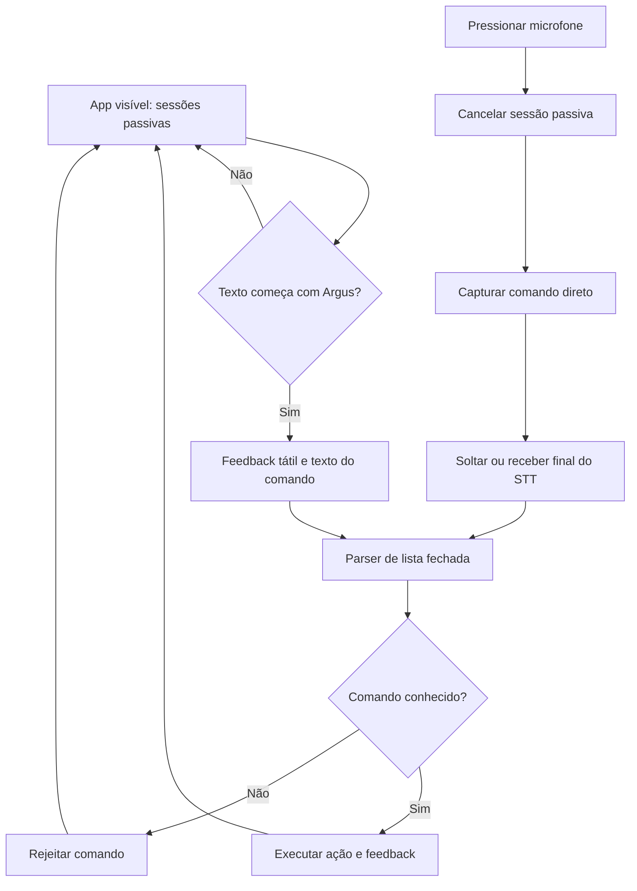

# Voz e acessibilidade no aplicativo

**Estado:** implementação presente, mas comandos continuam falhando no Redmi Note 10. A investigação foi adiada; consulte [V01](PENDENCIAS.md). Esta página descreve o comportamento previsto no código, não uma validação bem-sucedida no aparelho.

## Fluxo de voz

`VoiceInputController` coordena ambos os modos; `SpeechRecognitionService` encapsula `speech_to_text`; `VoiceCommandParser` normaliza caixa, acentos e pontuação e consulta uma lista fechada. Os modos ainda compartilham o mesmo controlador; não há motor dedicado de hotword.

### Passivo

Com a tela da câmera ativa, abre sessões curtas em português e exige o prefixo `Argus`. Uma transcrição contendo a palavra de ativação atualiza a caixa e solicita feedback tátil. A execução usa o texto reconhecido ao concluir a sessão.

Não é escuta contínua garantida com tela apagada ou aplicativo em segundo plano. O serviço do Android pode encerrar uma sessão por silêncio/timeout. Mudanças de ciclo de vida suspendem a escuta.

### Manual

O botão no canto inferior direito inicia a captura ao pressionar. Ao soltar, solicita parada e processamento; um resultado final antecipado também pode concluir o comando. Não exige `Argus`, mas aceita esse prefixo opcional. Com ativação semântica, uma ativação inicia e outra encerra.

Se pressionado durante escuta passiva, cancela a sessão passiva. Se uma ação já estiver sendo processada, o início manual é ignorado; não existe fila de comandos. Depois da conclusão, o controlador tenta retomar a escuta passiva. Corridas entre callbacks e ciclo de vida permanecem hipóteses para o diagnóstico pendente.

### Dependência de backend

O parser e a síntese ficam no aparelho. O STT usa o serviço do Android e pode depender da conectividade/idiomas desse serviço, mas não envia comandos ao backend Python do ARGUS. Capturar e analisar uma imagem exige o backend disponível.

## Comandos cadastrados

No passivo, acrescente `Argus` antes de cada comando.

| Comando | Ação |
|---|---|
| `capturar imagem`, `tirar foto`, `analisar agora` | Capturar e enviar ao backend |
| `repetir descrição` | Ler novamente a última descrição |
| `parar áudio` | Interromper TTS |
| `aumentar volume`, `diminuir volume` | Alterar volume |
| `abrir configurações`, `voltar à câmera` | Solicitar mudança de tela |
| `ativar modo porta`, `desativar modo porta` | Alternar modo de análise |
| `silenciar`, `ativar áudio`, `ligar áudio` | Controlar saída de áudio |
| `ajuda` | Ler ajuda de comandos |

A presença de uma ação no parser não garante que haja escuta ativa em todas as telas. Não usar essa tabela como evidência de que voltar por voz funciona a partir das configurações.

## Transcrição e configurações

Existe uma caixa em `widgets/transcription_panel.dart`, exibida no topo da câmera abaixo dos controles superiores. `SettingsService` persiste `showTranscription` na chave `argus.voice.showTranscription`. A câmera propaga a preferência ao controlador; a decisão de exibir fica na UI/estado, sem desativar reconhecimento ou execução.

## Controles e validação de acessibilidade

A câmera usa controles sobrepostos: mudo/ajuda no topo esquerdo, configurações no topo direito, modo porta/captura/repetição embaixo e microfone em destaque à direita. O volume também tem integração com os botões físicos Android.

Ao validar mudanças de UI:

1. Percorra todos os controles com TalkBack; anote rótulo, ordem e resultado de cada ativação.
2. Teste o microfone por ativação semântica, sem depender do gesto visual de segurar.
3. Aumente a fonte do sistema; confirme que rótulos e campos continuam acessíveis.
4. Meça contraste com imagens claras/escuras ao fundo: mínimo pretendido 4,5:1 para texto normal e 3:1 para texto grande/ícones. Verifique áreas de toque de pelo menos 48×48 unidades lógicas.
5. Confirme feedback de estado, vibração e áudio; teste mudo e TTS interrompido.
6. Repita câmera → configurações → câmera sem olhar a tela e registre falhas.

Esses itens são critérios de validação, ainda não uma certificação. iOS/VoiceOver não foram validados.

## Logs para retomar o diagnóstico

Builds debug registram `[ARGUS_VOICE]` com sessão, status, texto, erros e parse aceito/rejeitado. Os logs podem conter fala do usuário: mantenha-os locais e compartilhe somente trechos necessários e revisados. Consulte [histórico](history/12_DIAGNOSTICO_VOZ_REDMI_E_PLANO.md) para evidências anteriores.
